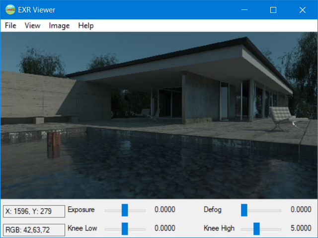

# EXRViewer
EXRViewer is a simple EXR viewer for use in windows. originally, it is ported from OpenEXR-Viewer.
And it use Win32 window system and GDI instead of 3-party graphics libs for image presenting.

## Build
1. download OpenEXR and zlib source code, put in the root directory of EXRViewer.
2. Open projects with Visual Studio 2015.

## Snapshot

## Dependency
- IlmBase
- OpenEXR
- zlib
